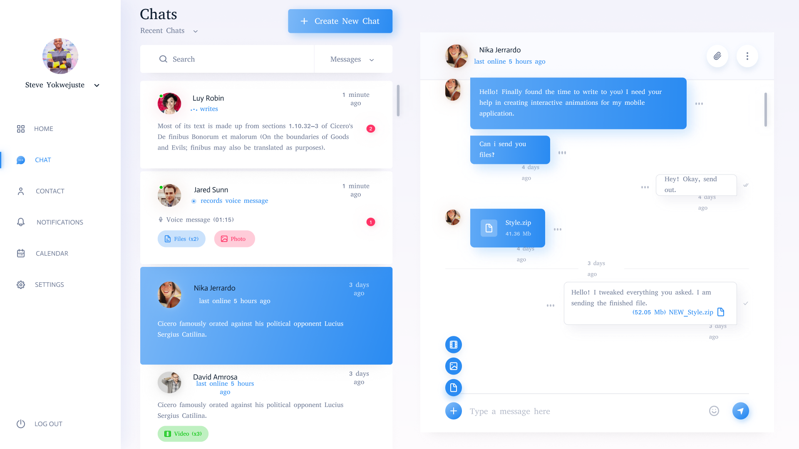

# <center>Altalkam</center>

A simple Chat web app in Reactjs. This is a small project I started to learn Reactjs features. Features like: [Context API](https://reactjs.org/docs/context.html), [Redux](https://redux.js.org/), [Redux-Saga](https://redux-saga.io/), [Redux-Thunk](https://redux.js.org/docs/api/thunk.html), [Redux-Logger](https://redux-logger.js.org/), [Routing with React Router](https://reacttraining.com/react-router/web/guides/quick-start), [React-Router-Dom](https://reacttraining.com/react-router-dom/web/guides/quick-start), [React-Transition-Group](https://reactcommunity.org/react-transition-group/) and [React-Bootstrap](https://react-bootstrap.github.io/react-bootstrap/).

### Tools used

-   [Reactjs](https://reactjs.org/)
-   [Nodejs](https://nodejs.org/)
-   [Tailwindcss](https://tailwindcss.com/)
-   [Nextjs](https://nextjs.org/)
-   [Bootstrap](https://getbootstrap.com/)
-   [Figma](https://www.figma.com)

### Features

-   [Context API](https://reactjs.org/docs/context.html)
-   [Redux](https://redux.js.org/)
-   [Redux-Saga](https://redux-saga.io/)
-   [Redux-Thunk](https://redux.js.org/docs/api/thunk.html)
-   [Redux-Logger](https://redux-logger.js.org/)
-   [Routing with React Router](https://reacttraining.com/react-router/web/guides/quick-start)
-   [React-Router-Dom](https://reacttraining.com/react-router-dom/web/guides/quick-start)


### Designs
#### User Interface :


## To Run Project Locally

Considering that [npm]() and [node]() installed.

```bash
    # Clonning project locally
    git clone https://github.com/yokwejuste/atalkam.git


    # Change directory in to the atalkam directory
    cd atalakm


    # install all project dependencies
    npm install


    # run project locally at the address, http://localhost:3000
    npm run start
```

## To contribute to [Atalkam](https://github.com/yokwejuste/atalkam) :

-   Fork this repository [🍴here](https://github.com/yokwejuste/atalkam/fork)
-   Clone it using your own remote, i.e. https://github.com/YourUsername/atalkam
-   Edit code make commits, push and pull request

## Contributors:
- [Steve Yonkeu](https://github.com/yokwejuste): Repository 


Project under the [GNU License](https://github.com/yokwejuste/atalkam/blob/master/LICENSE)